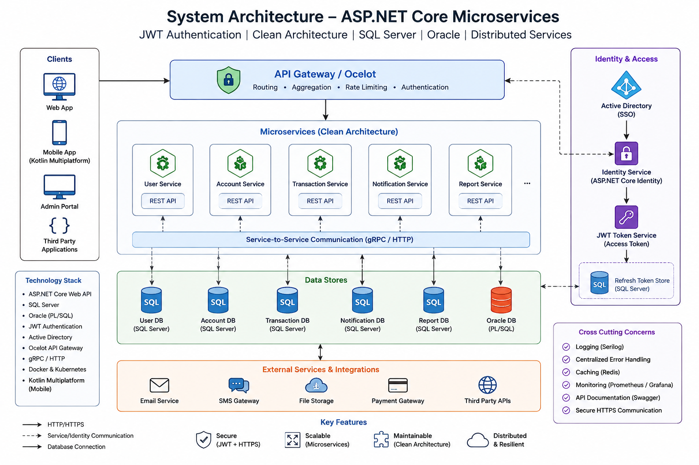

# Enterprise Digital Onboarding Platform

## Overview

A scalable and secure onboarding platform architecture designed for enterprise financial systems.

This repository demonstrates system architecture, workflow orchestration, API gateway communication, and secure service integration patterns used in enterprise-grade onboarding platforms.

> Note:
> Due to organizational confidentiality policies, source code is not publicly shared.
> This repository focuses on architecture, engineering decisions, workflows, and implementation strategy.

---

## Key Features
- Smart Notification Management System
- Secure OTP Generation & Validation
- Account Locking & Security Protection
- Customer Registration & Digital Onboarding
- Secure Login & Authentication
- Password Management & Recovery
- Deposit Account Opening Workflow
- FDR (Fixed Deposit Receipt) Management
- Loan Account Opening & Processing
- Encashment Facility Management
- E-KYC & Biometric Verification
- Real-Time Data Validation
- Core Banking System (CBS) Integration
- Distributed Service Architecture
- API Gateway Communication
- Workflow Recovery Mechanism
- Role-Based Access Control (RBAC)
- Secure Enterprise API Design
- Admin Management Console
- Audit Logging & Activity Tracking
- Customer Statement & Transaction Reports
- Tax Certificate Generation
- Balance Statement Services
- Customer Care & Support Facility
- Multi-Service Banking Operations
- Enterprise Workflow Automation

This application enables customers to securely access and manage various banking services including deposit accounts, FDR services, loan account opening, encashment facilities, account statements, tax certificates, balance reports, customer care services, and other enterprise banking operations through a unified digital banking platform.

---

# Architecture Highlights

- DMZ + Private VPC separation
- Dedicated onboarding service
- Service-to-service secure communication
- Recovery orchestration
- Role-based access concepts
- Database isolation strategy

---

# Technology Stack

- ASP.NET Core (Web API, MVC)
- RESTful API Design & Development
- Microsoft SQL Server (T-SQL, Query Optimization)
- Oracle PL/SQL (Stored Procedures, Packages, Triggers)
- Active Directory Integration (Authentication & Authorization)
- Secure HTTP Communication (HTTPS, TLS, Secure Headers)
- JWT Authentication & Authorization (Token-based Security)
- Distributed Service Architecture (Scalable System Design)
- Clean Architecture (Domain-Driven Design principles)
- Microservices Architecture (Service decomposition, communication patterns)
- Kotlin Multiplatform (Cross-platform mobile development)
- Regular Expressions (Regex) for validation & parsing in web applications

---

# My Responsibilities

As Lead Developer, responsibilities included:

- System architecture planning
- API design strategy
- Workflow orchestration
- Security implementation planning
- Integration architecture
- Service communication design
- Performance optimization
- Technical leadership

---

# Architecture Diagram

---

# Security Considerations

- HTTPS communication
- Private network isolation
- Gateway protection
- Service isolation
- Controlled access flow
- Identity integration

---

# Repository Purpose

This repository demonstrates enterprise architecture capabilities and system design experience without exposing confidential business logic or proprietary implementation details.
